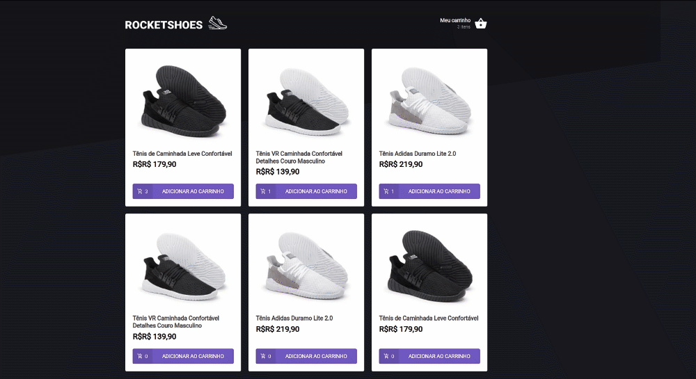

<h1 align="center">   </h1> 

<h1 align="center" > <strong>
 🛒Creating a shopping cart hook 
</h1>


<p align="center">	
   
    
  
  
  
  
</p>


# :books: About

<p align="justify">Rocketshoes is a footwear E-commerce Website. This third challenge has the main goal of implementing functionalities in its components, pages, and hooks.</p>

# :art: Layout

<div align="center">
  <p align="center">
    
  </p>
</div>

# :rocket: Tecnologies
- ReactJS
- Typescript
- Styled Components
- Json-server
- Context API
- Custom hooks


# 🔧 Run Locally

Clone the project

```bash
  git clone git@github.com:Joseane-Guedes/ignite-reactjs-challenge3.git
```

Go to the project directory

```bash
  cd ignite-reactjs-challenge3
```

Install dependencies

```bash
  yarn 
```

Start the server

```bash
  yarn server 
```

# :closed_book: License

Released in 2021 :closed_book: License

This project is under the [MIT license](./LICENSE).

#

<!-- <p align="center">
   <b> &#60;/&#62; by <a href="https://www.linkedin.com/in/joseane-guedes/">Joseane Guedes</a></b>
</p> -->

Made with :purple_heart: by [Rocketseat](https://rocketseat.com.br/ignite) :rocket: and [Joseane Guedes ](https://github.com/Joseane-Guedes) :woman_technologist: 


